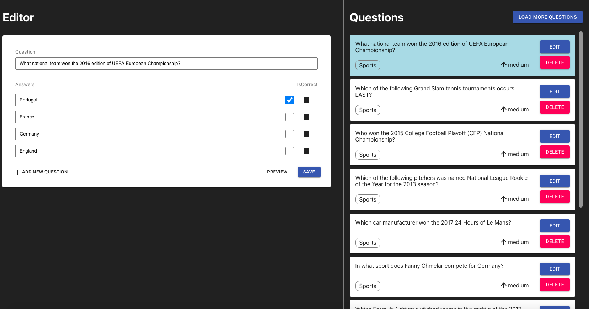

### Simple Quiz Editor SPA

### About the project



- Load questions and edit them on your side before submition
- You can load more question using the following API. (https://opentdb.com/api.php?amount=10&category=21&difficulty=medium&type=multiple)
- You can also delete any question(s).
- You can edit questions like changing correct/incorrect answers, adding or removing some answers, changing question title.

### Built With

- [React](https://reactjs.org/docs/getting-started.html)
- [Typescript](https://www.pluralsight.com/guides/typescript-react-getting-started)
- [Material-UI](https://material-ui.com/)
- [@testing-library/react](https://testing-library.com/docs/react-testing-library/intro/)
- [React-Hook-Form](https://react-hook-form.com/get-started/)
- [Redux](https://redux.js.org/introduction/getting-started)
- [Redux-Saga](https://redux-saga.js.org/docs/introduction/BeginnerTutorial.html)
- [...]

### Prerequisites

- npm or yarn
- node

### Installation

1. Clone the repo

```sh
git clone https://github.com/sweetmate-dev/react-typescript-redux-material.git
```

2. Install packages

```sh
yarn install
```

3. Run project

```sh
yarn start
```

4. Run Unit Tests

```sh
yarn test
```

### Redux and Types

- Actions

```JS
export const QuestionActionTypes = {
  GET_QUESTIONS_REQUEST: "GET_QUESTIONS_REQUEST",
  GET_QUESTIONS_SUCCESS: "GET_QUESTIONS_SUCCESS",
  GET_QUESTIONS_FAILURE: "GET_QUESTIONS_FAILURE",
  DELETE_QUESTION_REQUEST: "DELETE_QUESTION_REQUEST",
  SELECT_QUESTION: "SELECT_QUESTION",
  UPDATE_SELECTED_QUESTION: "UPDATE_SELECTED_QUESTION",
};
```

- Reducers

```JS
import { Question } from "../../types/Question";
import { QuestionActionTypes } from "../types";

export interface QuizState {
  questions: Question[];
  loading: boolean;
  selectedQuestion?: Question | {};
}

const initialQuizState: QuizState = {
  questions: [],
  loading: false,
  selectedQuestion: {},
};

export function questionReducer(state = initialQuizState, action) {
  switch (action.type) {
    case QuestionActionTypes.GET_QUESTIONS_REQUEST:
      return {
        ...state,
        loading: true,
      };
    case QuestionActionTypes.GET_QUESTIONS_SUCCESS:
      return {
        ...state,
        loading: false,
        questions: [...action.payload, ...state.questions] as Question[],
      };
    case QuestionActionTypes.DELETE_QUESTION_REQUEST:
      return {
        ...state,
        questions: [...state.questions.slice(0, action.payload), ...state.questions.slice(action.payload + 1)],
      };
    case QuestionActionTypes.SELECT_QUESTION:
      return {
        ...state,
        selectedQuestion: action.payload,
      };
    case QuestionActionTypes.UPDATE_SELECTED_QUESTION:
      return {
        ...state,
        selectedQuestion: action.payload,
      };
    default:
      return state;
  }
}
```

- Sagas

1. Fetch questions using API.
2. Remove the duplicated questions because API returns 10 dummy questions randomly per request.
3. Convert the returned questions to valid question type, because API returns the questoins that have only one correct answer as string. (A question should be able to have multiple correct answers).

```JS
import { call, put, select } from "redux-saga/effects";
import { Question } from "types/Question";
import { API } from "../../api/sportsapi";
import { QuestionActionTypes } from "../types";

export function* getQuestions() {
  try {
    const {
      quiz: { questions },
    } = yield select();
    // 1
    const result = yield call(API.getQuestions, null);
    if (result.data && result.data.response_code === 0) {
      // 2
      const filtered = result.data.results.filter((i) => !questions.find((q) => q.question === i.question));
      // 3
      const newQuestions: Question[] = filtered.map((question) => {
        return {
          ...question,
          correct_answers: [question.correct_answer],
        };
      });
      yield put({
        type: QuestionActionTypes.GET_QUESTIONS_SUCCESS,
        payload: newQuestions,
      });
    } else {
      yield put({
        type: QuestionActionTypes.GET_QUESTIONS_FAILURE,
      });
    }
  } catch (error) {
    console.error(error);
  }
}
```

- Types

```JS
export type Difficulty = "easy" | "medium" | "hard";
export type QuestionType = "multiple" | "boolean";

export interface Question {
  category: string;
  type: QuestionType;
  difficulty: Difficulty;
  question: string;
  correct_answers: string[];
  incorrect_answers: string[];
}

```

### Unit Test

Tested question editor view(left section) for 5 test cases.

- Editor card should be invisible unless you select a question.
- If question title is empty, you should see the relevant error message.
- If an answer is empty, you should see the relevant error message.
- If all answers are selected as 'correct', you should see the relevant error message.
- If all answers are selected as 'incorrect', you should see the relevant error message.
